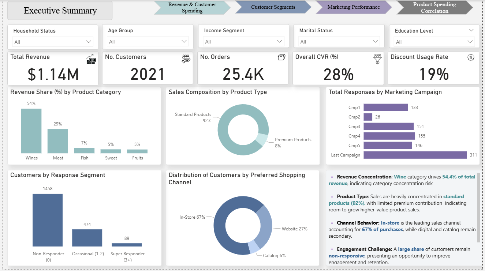
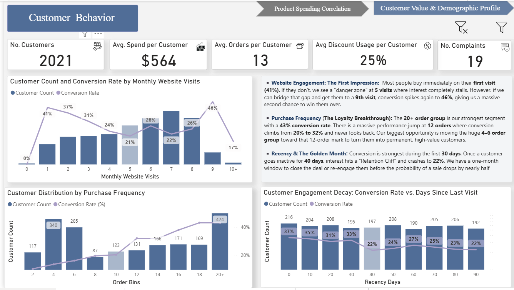
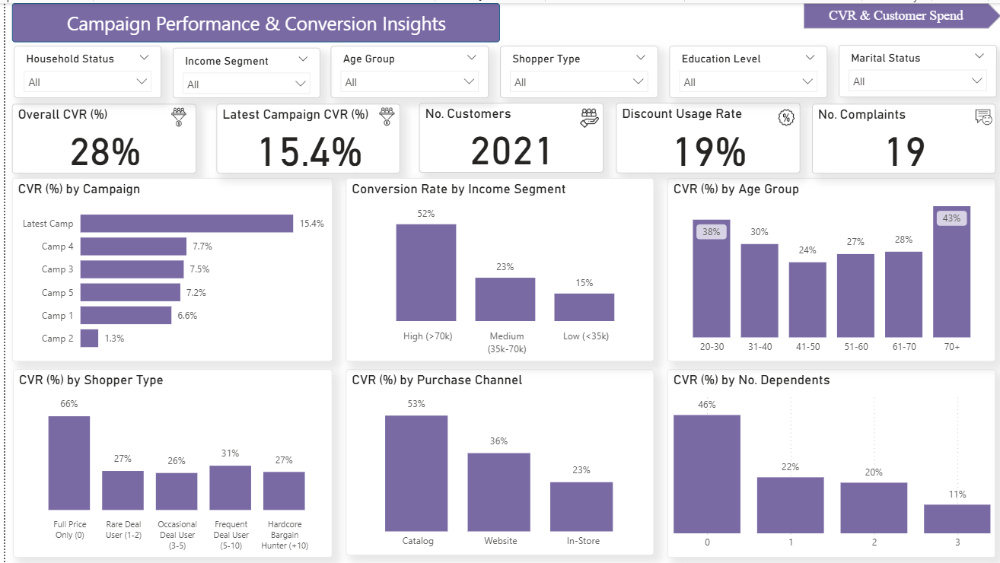
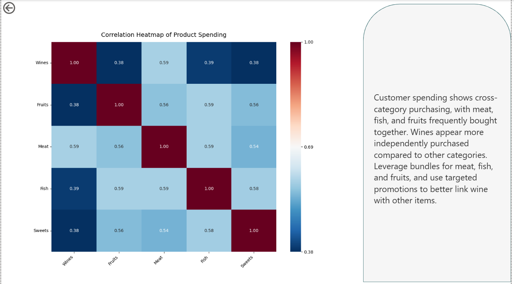

# Marketing Analytics & Customer Behavior Dashboard

I built this dashboard to analyze customer spending and marketing campaign performance using the iFood marketing dataset. It’s designed to help a marketing team or data analyst understand who their customers are, what they’re buying, and which campaigns actually move the needle.

## Project Goal
The main idea was to move beyond basic reporting. I wanted to see the relationship between demographics (like income and age) and purchasing behavior, while also identifying the "point of no return" for customer retention.

## What’s in the Data?
The analysis is based on a dataset of ~2,200 customers (provided in the `ifood_df.csv` file) and includes:
* **Spending Categories:** Wines, Fruits, Meat, Fish, Sweets, and Gold products.
* **Campaigns:** Tracking acceptance rates for 5 different marketing pushes plus the final response.
* **Channels:** Comparing Web, Catalog, and In-Store purchases.
* **Demographics:** Age, income, education, and household composition.

## Dashboard Walkthrough

### 1. Executive Summary
This is the high-level view. It tracks the core KPIs like total revenue ($1.14M) and total customers. You can quickly see that Wine is the heavy hitter here, making up over 54% of our total sales.

### 2. Customer Behavior & Retention
I used this page to look at how engagement drops off over time. There is a clear "retention cliff" around 40 days of inactivity. It also maps out how many website visits it usually takes before a customer converts.

### 3. Campaign Performance
This page isolates the marketing campaigns. It shows that our most recent campaign hit a 15.4% conversion rate. I also broke down shoppers into groups like "Full Price Only" vs. "Bargain Hunters" to see who is actually responding to our offers.

### 4. Product Spending Correlation
I included a correlation heatmap (built with Python) to see which products are bought together. For example, customers who buy meat are very likely to buy fruits and fish as well—valuable info for creating better bundles.

## Tech Stack
* **Dashboard Tool:** Power BI Desktop
* **Data Source:** CSV (`ifood_df.csv`)
* **Modeling:** DAX for custom measures (CVR calculation, customer segmentation logic, and retention bins)
* **Custom Visuals:** Python (Seaborn/Matplotlib) for the correlation matrix

## Setup & Usage

1.  **Get the files:** Download the `Marketing_Performance_Analysis.pbix` and the `ifood_df.csv` file.
2.  **Open Power BI:** Open the `.pbix` file in Power BI Desktop.
3.  **Link the Data:** If the visuals don't load, go to **Transform Data** > **Data source settings**, change the source path to your local `ifood_df.csv`, and hit **Refresh**.
4.  **Interact:** All charts are cross-filtered. Click on a specific income segment or age group to see how the rest of the dashboard updates.

## Future Improvements
* Build a predictive model to flag customers as "at-risk" before they hit the 40-day drop-off mark.
* Integrate an automated email trigger for customers in the "Bargain Hunter" segment when new deals go live.
